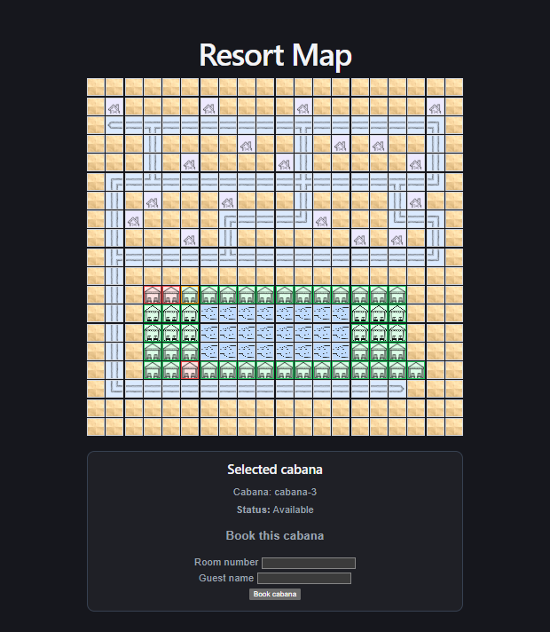

# Resort Map — Code Test

Resort Map is a full-stack web application for interactive cabana booking at a luxury resort.  
It displays a resort map based on an ASCII input file, shows cabana availability in real time, and allows guests to book an available cabana after validating their room number and guest name through a REST API.

## Table of Contents

- [Features](#features)
- [Tech Stack](#tech-stack)
- [Project Structure](#project-structure)
- [How to Run the App](#how-to-run-the-app)
- [API Endpoints](#api-endpoints)
- [Running Tests](#running-tests)
- [Screenshot](#screenshot)
- [Design Decisions and Trade-offs](#design-decisions-and-trade-offs)
- [Notes](#notes)
- [Author](#author)

## Features

- Interactive resort map rendered from backend API data
- Visual support for map tiles:
  - `W` = cabana
  - `p` = pool
  - `#` = path
  - `c` = chalet
  - `.` = empty space
- Clickable cabanas with availability status
- 1-step booking flow for available cabanas
- Validation of booking by room number and guest name
- Immediate map update after successful booking
- Clear success and error messages
- Automated backend and frontend tests

## Tech Stack

### Frontend

- React
- TypeScript
- Vite
- CSS

### Backend

- Node.js
- Express
- TypeScript

### Testing

- Vitest
- React Testing Library
- Supertest

## Project Structure

```text

|-- backend
|-- frontend
|-- bookings.json
|-- map.ascii
|-- screenshot.png
|-- AI.md
|-- README.md
|-- start-dev.js
|-- TASK.md
```

## How to Run the App

### Install dependencies

Run the following commands from the project root to install dependencies for the root, backend, and frontend:

```bash
npm install
npm --prefix backend install
npm --prefix frontend install
```

### Start the full application from the project root:

```bash
npm run start
```

### Default local URLs

Frontend: http://localhost:5173
Backend: http://localhost:3000

### CLI Arguments

#### The root start command accepts:

```bash
--map <path> — path to the ASCII map file
--bookings <path> — path to the bookings/guest file
```

Example:

```bash
npm run start -- --map ./map.ascii --bookings ./bookings.json
```

#### If no arguments are provided, the app uses:

- map.ascii
- bookings.json

from the project root.

## API Endpoints

### GET /api/health

Returns simple health status.

### GET /api/map

#### Returns map data required by the frontend:

- map size
- tiles
- cabanas
- availability state

### POST /api/cabanas/:cabanaId/book

#### Books a cabana if:

- the cabana is available
- the provided room number and guest name match the bookings file

### Example request body:

```json
{
  "roomNumber": "101",
  "guestName": "Alice Smith"
}
```

### Running Tests

#### Run all tests from the project root:

```bash
npm test
```

#### Run backend tests only:

```bash
npm run test:backend
```

#### Run frontend tests only:

```bash
npm run test:frontend
```

## Screenshot

See screenshot.png for an example of the running application.
[](./screenshot.png)

## Design Decisions and Trade-offs

- This project was designed to stay simple and match the task requirements closely.

### Main decisions

- The frontend relies fully on the REST API for map data and booking actions.
- The backend keeps cabana booking state in memory, because persistent storage was not required.
- The map layout is loaded from the ASCII file, while booking validation is based on the provided bookings JSON file.
- The booking flow was kept as a 1-step interaction to make the UI fast and clear.

### Trade-offs

- Cabana booking state is not persisted after server restart.
- No authentication was added, because the task explicitly says room number and guest name are enough.
- The UI is intentionally simple and focused on the required booking flow instead of extra features or styling complexity.

## Notes

- This solution uses a single root command to start both backend and frontend.
- The project was intentionally kept small and readable to avoid over-engineering.
- AI workflow documentation is included in AI.md.

## Author

Created by [Mariusz Różycki](https://github.com/MariuszRozycki)
